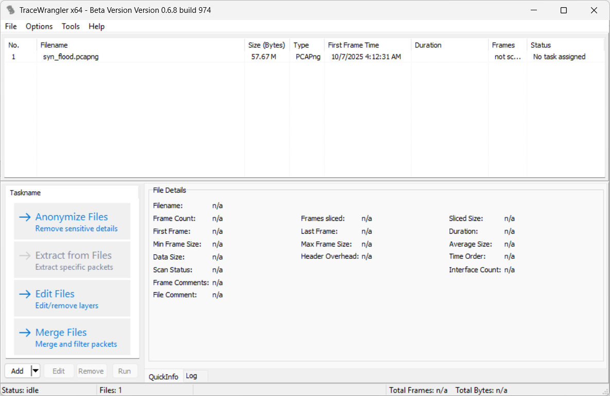
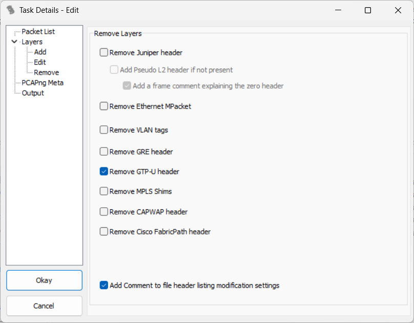
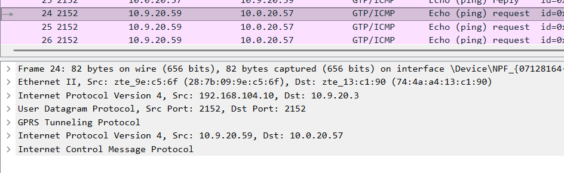
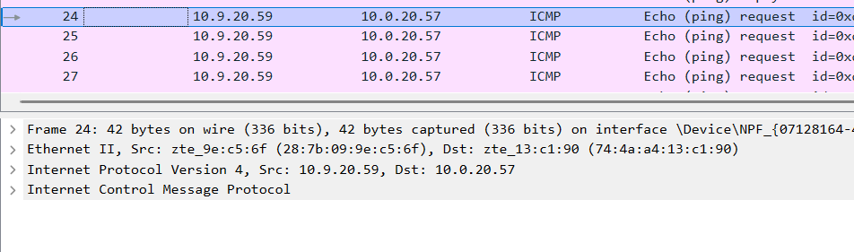

# My 5G Network Anomaly Dataset Processing Steps

This README.md will show how to convert raw packet captures (pcapng) into machine learning–ready datasets(.csv).

---

## 🌐 Step 1: Capture Raw Traffic

Collect raw data from real 5G testlab using Wireshark

<br>Here is my packet capture (pcapng) files link:
```bash
https://mmuedumy-my.sharepoint.com/my?id=%2Fpersonal%2F1211110323%5Fstudent%5Fmmu%5Fedu%5Fmy%2FDocuments%2FPCAP&viewid=e3af6dff%2D37bb%2D422e%2Da01f%2D80d90eebd189&ga=1)
```

<br>

---

## 🧰 Step 2: Remove GTP Layer (TraceWrangler)

Open TraceWrangler → Load your `.pcapng` file → Apply **Remove GTP-U headers** in `Edit Files` task → Run the task





<br>Before removing GTP:



<br>After removing GTP:



<br>

---

## 📊 Step 3: Convert Decapsulated PCAPNG to Network Flow (Argus)

After removing the GTP layer, the resulting file becomes a **decapsulated pcapng**, where each packet now contains the real IP/TCP/UDP headers of user-plane traffic.  

We use Argus which is a network flow analysis tool to convert decapsulated packet capture files `.pcapng` into network flow records `.argus`. These flow records are later used to extract dataset features.

### 🧾 Command

```bash
#Convert packet capture files into flow records
argus -r file_name.pcapng -w file_name.argus
```

<br>

--- 

## 🧮 Step 4: Feature Extraction (Argus)

Once the `.argus` network flow file has been generated, we extract all **available flow-level features** using the Argus client tool (`ra`). These features are directly generated by Argus and represent network statistics collected per flow.

### 🧾 Command

```bash
#Extract features and convert to .csv file
ra -r file_name.argus \
   -s seq dur mean proto stos dtos sdsb ddsb sttl dttl pkts spkts dpkts bytes sbytes dbytes \
      offset load sload dload loss sloss dloss ploss rate srate drate state swin dwin \
      svid dvid stcpb dtcpb tcprtt synack ackdat \
   -c, > file_name.csv
```

<br>You can see summarized flow data before convert to .csv, For example,

```bash
ra -r file_name.argus -s saddr daddr proto sport dport bytes pkts dur bytes
```

<br>You can also can see available extractable features. See the command at line label `-s`
```bash
ra -h
```

<br>

--- 

## 🧩 Step 5: Additional Feature Computation & Labeling (Jupyter Notebook /Python)

After Argus extraction, additional features can be computed or labeled externally, so we can use Python to perform it.

### 📦 Install & Use Anaconda (Python environment)

To simplify package management and environment setup, I use **Anaconda** (or **Miniconda**) — it bundles Python, Jupyter Notebook, and common data science libraries (e.g. `pandas`, `numpy`, `matplotlib`).  
You can install it from:

- **Anaconda Distribution**: https://www.anaconda.com/products/distribution  

<br>After installation, we run Jupyter Notebook in `Anaconda Prompt`

```bash
jupyter notebook
```


