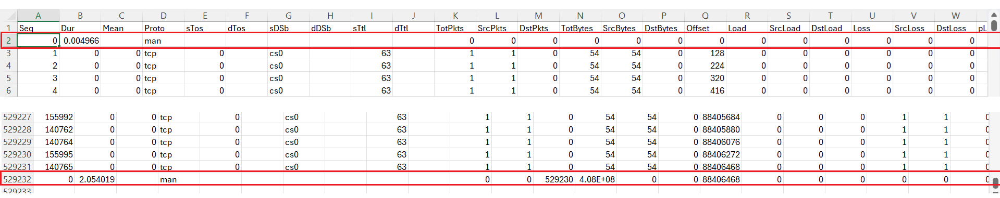

# 5G Network Anomaly Dataset for Intrusion Detection

This README.md contains dataset of network traffic from a real 5G test lab environment, designed for developing and testing anomaly and intrusion detection systems. The dataset includes both `benign` traffic and `malicious` traffic from **flooding** , **fuzzing** and **Denial-of-service (DoS)** attacks.

---

## 📋 Table of Contents

-   [Overview](#-overview)
-   [Dataset Description](#-dataset-description)
-   [Data Generation Pipeline](#-data-generation-pipeline)
-   [Feature set ](#-feature-set)

---

## 📝 Overview


---

## 📊 Dataset Description

The final dataset is available in the `/dataset` directory as `5G_anomaly_dataset.csv`. It contains network flow records, where each row represents a unidirectional or bidirectional flow of packets between a source and a destination. Each flow is described by a set of features and is labeled as either **Benign** or **Malicious**.

| Category    | Description                                      |
| :---------- | :----------------------------------------------- |
| Benign      | Normal traffic simulating user activity          |
| Malicious   | Traffic from flooding, fuzzing or Dos attacks    |

---

## 🧪 Data Generation Pipeline

The dataset was created using four-step process, designed to transform raw packet captures into a machine learning–ready datasets(.csv)

### 🌐 Step 1: Capture Raw Traffic

Perform attacks and collect raw data from real 5G testlab using Wireshark. Here is the packet capture (pcapng) files link:

```bash
https://mmuedumy-my.sharepoint.com/my?id=%2Fpersonal%2F1211110323%5Fstudent%5Fmmu%5Fedu%5Fmy%2FDocuments%2FPCAP&viewid=e3af6dff%2D37bb%2D422e%2Da01f%2D80d90eebd189&ga=1)
```

---

### <br>🧰 Remove GTP Layer (TraceWrangler)

Open TraceWrangler → Load your `.pcap/.pcapng` file → Apply **Remove GTP-U headers** in `Edit Files` task → Run the task


<br>Before removing GTP:


After removing GTP:


---

### <br>📊 Step 3: Convert Decapsulated Packet Capture to Network Flow (Argus)

After removing the GTP layer, the resulting file becomes a **decapsulated pcapng**, where each packet now contains the real IP/TCP/UDP headers of user-plane traffic.  

We use Argus which is a network flow analysis tool to convert decapsulated packet capture files `.pcapng` into network flow records `.argus`. These flow records are later used to extract dataset features.

 🧾 Command

```bash
#Convert packet capture files into flow records
argus -r file_name.pcapng -w file_name.argus
```

--- 

### <br>🧮 Step 4: Feature Extraction (Argus)

Once the `.argus` network flow file has been generated, we extract all **available flow-level features** using the Argus client tool (`ra`). These features are directly generated by Argus and represent network statistics collected per flow.

🧾 Command

```bash
#Extract features and convert to .csv file
ra -r <name>.argus -s seq dur mean proto stos dtos sdsb ddsb sttl dttl pkts spkts dpkts bytes sbytes dbytes offset load sload dload loss sloss dloss ploss IntPkt dIntPkt rate srate drate state swin dwin svid dvid stcpb dtcpb tcprtt synack ackdat -c, > <name>.csv
```

<br>You can see summarized flow data before convert to .csv, For example,

```bash
ra -r file_name.argus -s saddr daddr proto sport dport bytes pkts dur bytes
```

<br>You can also can see available extractable features. See the command at line label `-s`
```bash
ra -h
```

--- 

## 📈 Feature Set

## <br>🧩 Step 5: Additional Feature Computation & Labeling (Jupyter Notebook /Python)

After Argus extraction, additional features can be computed or labeled externally, so we can use Python to perform it.

### 📦 Install & Use Anaconda (Python environment)

To simplify package management and environment setup, I use **Anaconda** (or **Miniconda**) — it bundles Python, Jupyter Notebook, and common data science libraries (e.g. `pandas`, `numpy`, `matplotlib`).  
You can install it from:

- **Anaconda Distribution**: https://www.anaconda.com/products/distribution  

<br>After installation, we can run Jupyter Notebook in `Anaconda Prompt`

```bash
jupyter notebook
```

<br>Now we can start to extract features in Argus-extracted CSV files, open a notebook, import your csv

```bash
import pandas as pd
import numpy as np

# Load the Argus CSV output
df = pd.read_csv("file_name.csv")
```

<br>Then add and compute additional features for each `.csv` files. Here are my commands in notebook:

First, I will drop unecessary rows. 



```bash
# Drop rows with "man" in Proto
df = df[df['Proto'] != 'man']
```


#### <br>Add features: `Label`, `Attack Type`, `Attack Tool` 

So for in my csv files, there have:
- **Label**: Malicious
- **Attack Type**: ICMPFlood/UDPFlood/SYNFlood/HTTPFlood/SlowrateDos
- **Attack Tool**: Hping3/Goldeneye/Slowloris/Torshammer 

 🧾 Example Command
```bash
#Insert colums at the last column (default)
df["Label"] = "Malicious"
df["Attack Type"] = "SYNFlood"
df["Attack Tool"] = "Hping3"
```


#### <br>Add features: - `Sum`, `Min`, `Max`

 🧾 Command
```bash
# Insert new columns and at specific column replicate with existing column content
df.insert(3, "Sum", df["Mean"])
df.insert(4, "Min", df["Mean"])
df.insert(5, "Max", df["Mean"])
```

Before insert column at specific column, we can check the column number
```bash
# Show column names with their numbers
for i, col in enumerate(df.columns):
    print(i, col)
```


#### <br>Add features: - `SrcGap`, `DstGap`

 🧾 Command
```bash
# Insert new columns at specific column and replicate with existing fixed column content
df.insert(3, "Sum", df["Mean"])
df.insert(4, "Min", df["Mean"])
df.insert(5, "Max", df["Mean"])
```

#### <br>Add features: - `sHops`, `dHops`


